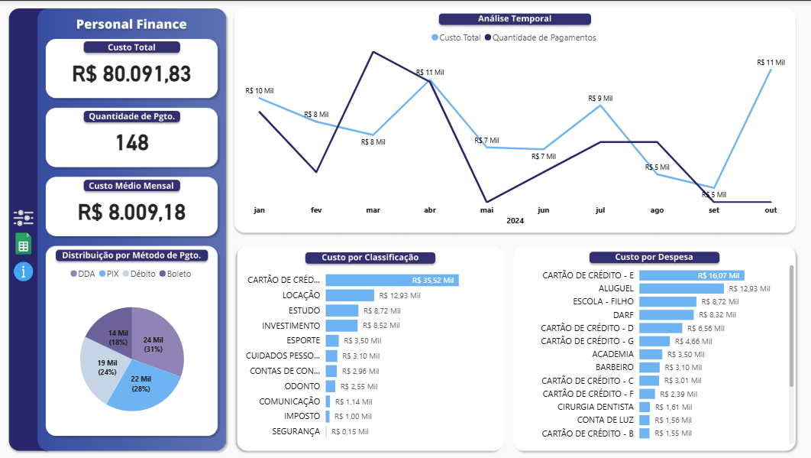
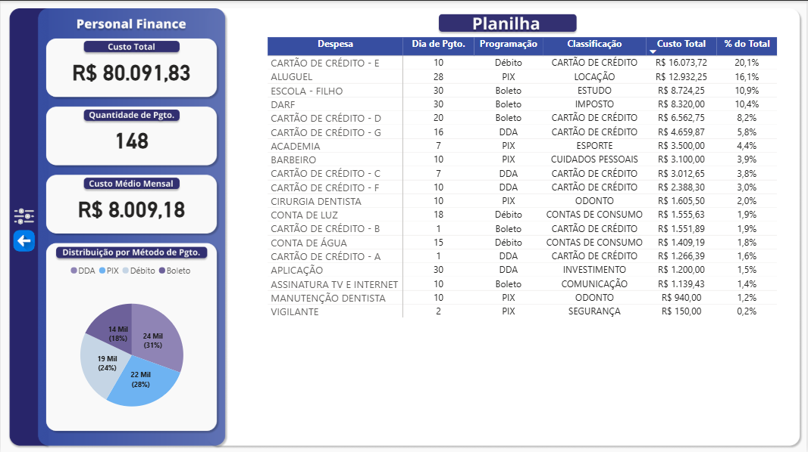
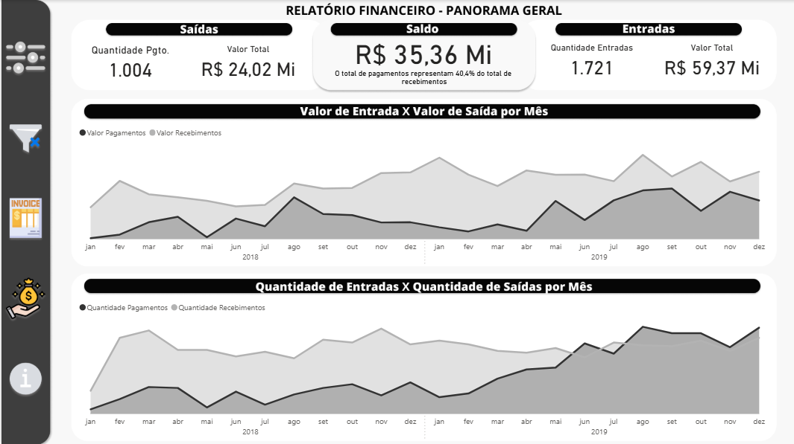
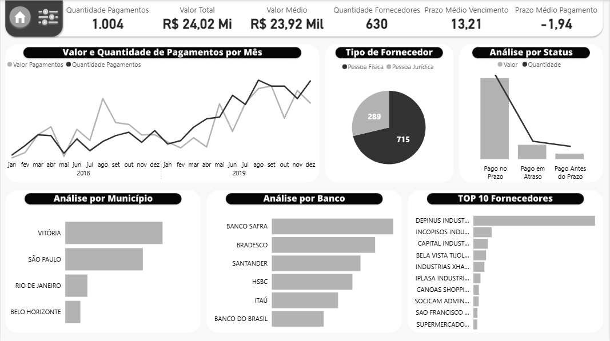
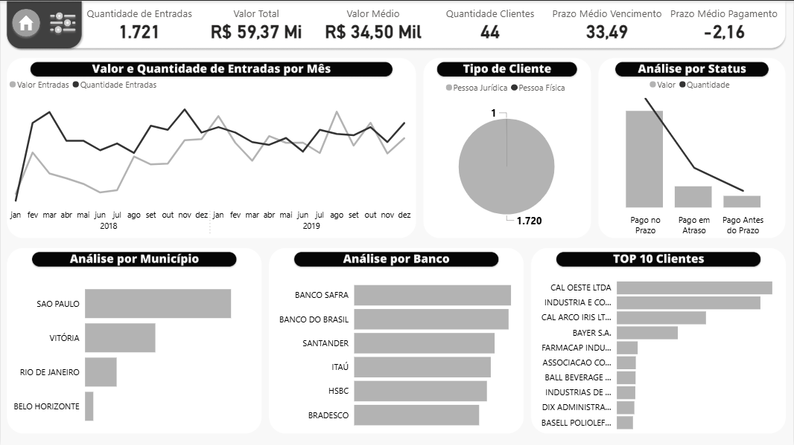
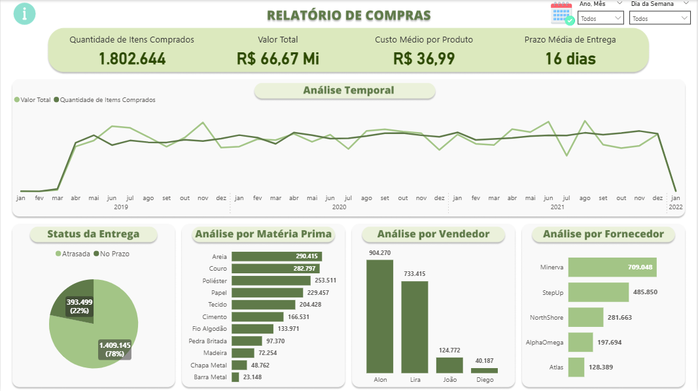
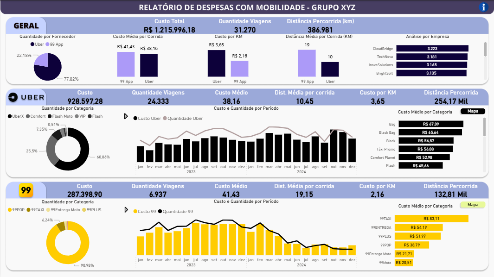

# 📊 Power BI Dashboard Project

📝 **Description**  
Interactive dashboard developed in Power BI, focusing on data transformation, modeling, and visualization to deliver clear and actionable insights. In the files, you can find the `.pbix` archive with all measures and the full construction of the Power BI dashboard. Below are screenshots showing the final results.

---

## 📄 Personal Finances  
 

## 📄 Financial Overview  

## 📄 Purchasing  

## 📄 Mobility Expenses  

---

🛠️ **Tools Used**  
- Power BI Desktop  
- Power Query  
- Data Modeling  
- DAX (Data Analysis Expressions)

🎯 **Objectives**  
- Present key metrics and indicators clearly  
- Highlight trends, patterns, and anomalies  
- Support data-driven decision-making through visuals

💬 *If you have any suggestions or feedback, feel free to send me a message through my social media linked in my bio.*
